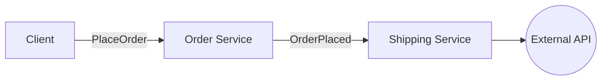

##
For the purpose of example, let's take two microservices **OrderService**, **ShippingService**. each service has different domain that he manage and they should communicate with each other to complete the mission of shifting client order. for simplicity lets take the following events diagram:

Client request to purchase a production - request goes into the OrderService to handle the order details and saving it to service db. when order service finished - shipping service should start handling the shipment of this order and communicate with external API that handler the physical shipment.

Let's explore how can we implement that with MicroJS, the main idea behind the package is to simplify the  complexity of using Kafka and to translate this complexity into a simple and abstract implementation:

Let's see how we can implement OrderService:
